This document is about Azure products and services.

# Synapse

## Authorization to SQL objects

### Local user

When creating a local user, instead of (in Azure SQL Server)

```sql
CREATE USER some_user WITH PASSWORD = 'someg00dpassword!@#$';
```

use

```sql
CREATE LOGIN some_user WITH PASSWORD = 'someg00dpassword!@#$';
CREATE USER some_user FROM LOGIN some_user;
```

### Entra user

For Entra users, instead of (in Azure SQL Server)

```sql
CREATE USER SomeApp FROM EXTERNAL PROVIDER;
```

use

```sql
CREATE LOGIN SomeApp FROM EXTERNAL PROVIDER;
CREATE USER SomeApp FROM LOGIN SomeApp;
```

## Authorization to external data

### Access data using Synapse Managed identity

Goal: we want to set up database objects in Synapse where:
- Access to data is controlled by permissions in Synapse
- Access to the data storage is done using the Synapse Workspace's managed identity

(An alternate setup is to have control both via the logged-in user).

1.  ```sql
    CREATE MASTER KEY ENCRYPTION BY PASSWORD='storedInSecureLocation';
    ```
    - Once per database
2.  ```sql
    CREATE DATABASE SCOPED CREDENTIAL msi_cred with IDENTITY = 'MANAGED IDENTITY'
    ```
    - `MANAGED IDENTITY` is a magic string
    - Once per database
3.  ```sql
    CREATE EXTERNAL DATA SOURCE [containername_servicename] 
    WITH (
        LOCATION = 'abfss://containername@servicename.dfs.core.windows.net',
        CREDENTIAL = msi_cred
    )
    ```
    - Once per container
4.  ```sql
    GRANT REFERENCES ON msi_cred TO SomeApp, SomeUser
    ```
    - Once per principal

    - Test it out:

      ```sql
      SELECT *
      FROM OPENROWSET(
          BULK 'some_file.csv',
          DATA_SOURCE = 'containername_servicename',
          FORMAT = 'CSV', PARSER_VERSION = '2.0', HEADER_ROW = true
      ) X
      ```
    - [OPENROWSET Reference](https://learn.microsoft.com/en-us/azure/synapse-analytics/sql/develop-openrowset)

5. Use the Synapse analytics UI to generate SQL for an external table and modify to match:
	```sql
    CREATE EXTERNAL TABLE dbo.tablename (...)
	WITH (
		LOCATION = 'filename.csv',
		DATA_SOURCE = [containername_servicename],
		FILE_FORMAT = [HeaderedCsvFormat]
	)
    ```
6.  Grant the managed identity for the synapse workspace 'Storage Blob Data Contributor' to the storage account

[Reference](https://learn.microsoft.com/en-us/azure/synapse-analytics/sql/develop-storage-files-storage-access-control)

# Data Factory

## Calling a durable function

The task: as part of a Data Factory pipeline, call a Durable function that performs a long-running task, like syncing some data.

Here's a diagram representation of a snippet of a Data Factory pipeline that does that:

```mermaid
flowchart LR
    Kickoff["⚡ *Azure Function*<br>Kickoff Sync"]
    Web["🌐 *Web*<br>Wait for Sync completion"]
    subgraph If ["╦ *If Condition*: Check for failure"]
        false["*false*: Fail on error"]
    end
    Kickoff--✅-->Web
    Web--✅-->If
```



- The Azure Function activity "Kickoff Sync" kicks off the processing
  - The return from a durable function is a JSON object containing the monitoring URL
- The Web activity "Wait for Sync completion" monitors the status of the processing
  - The URL being visited is the expression: `@activity('Kickoff Sync').output.statusQueryGetUri`
  - By default, the activity reloads HTTP 202 responses until it's a 200, which matches what the durable function monitoring endpoint returns
- The If activity "Check for failure" monitors whether the processing done by the durable function was successful
  - The condition in the example is `@equals(activity('Wait for Sync completion').output.runtimeStatus, 'Completed')`
  - If the condition is false, then the overall pipeline should fail as the function has failed, otherwise no action is needed and the pipeline can continue

### Database authentication in a durable function

In data lake/data warehouse scenarios, I prefer using Azure authentication. This means setting up a managed identity for the function and granting access to that idenity in the database.

When setting up a function, one uses `Authentication=Active Directory Default;` in the connection string to use the built-in Azure identity.

For local development, one uses `Authentication=Active Directory Interactive;` in the connection string to prompt developers to log into Azure in the browser.
